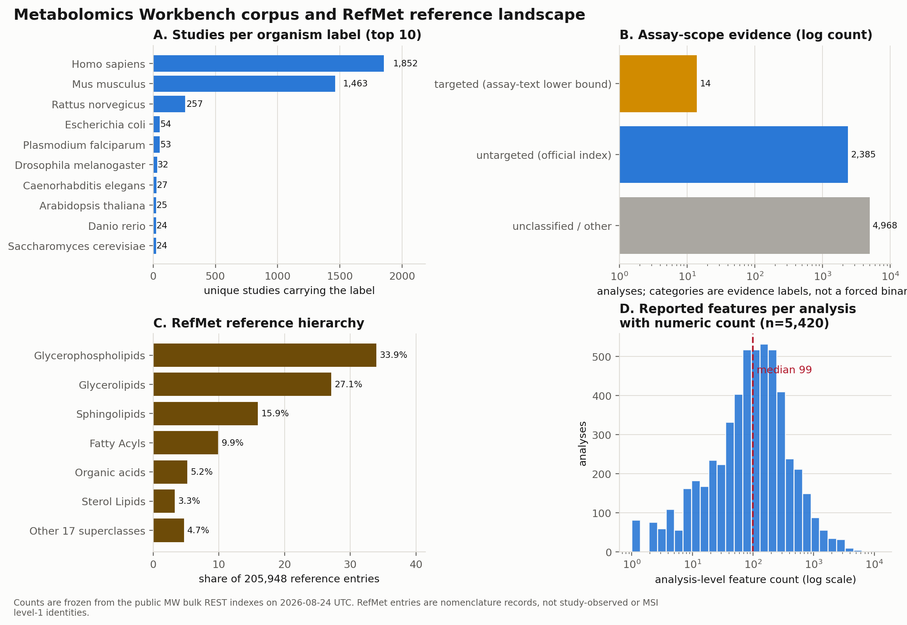

# MetaboTyping RA Agent Workbench

## Final capability and data-landscape report

**Condensed evidence report | MW corpus snapshot: 24 August 2026, 04:29 UTC**

This report answers two questions: what is present in the current Metabolomics Workbench (MW) bulk indexes, and what can the MetaboTyping RA Agent Workbench do with repository-scale metabolomics evidence? Counts are frozen to one provenance-tracked retrieval. Every number retains its denominator; study summaries, analyses, organism incidences, reported feature counts, and RefMet nomenclature entries are intentionally kept separate.

| Executive measure | Audited result | Interpretation |
|---|---:|---|
| MW study summaries | 4,499 | Unique `ST` records after one additional row sharing a study ID was removed |
| MW analyses | 7,367 | Unique analysis IDs after three additional rows sharing analysis IDs were removed |
| Organism coverage | 4,483 studies; 4,770 incidences; 481 labels | 4,395 single-species and 88 multi-species studies |
| Assay evidence | 2,385 untargeted; 14 explicit targeted; 4,968 unclassified | Analysis-level categories; targeted is a strict lower bound |
| Reported feature volume | 1,231,376 instances across 5,420 numeric records | Median 99 per reported analysis; not unique metabolites |
| RefMet reference snapshot | 205,948 entries | 23 superclasses, 333 main classes, 960 subclasses |
| Workbench inventory | 22 canonical roles; 24 logical skills | Two deprecated role aliases are not extra capabilities |
| Source-routing inventory | 28 sources; 27 lanes | Registration does not imply that every source has a live adapter |

## 1. Metabolomics Workbench corpus

### Study and species landscape

The official MW bulk endpoints yielded 4,500 summary rows and 7,370 analysis rows. Deterministic de-duplication retained the first record per identifier and removed one additional row sharing study ID `ST002097` plus three additional rows sharing analysis IDs, leaving **4,499 studies and 7,367 analyses**. This rule establishes identifier uniqueness, not that the removed rows were content-identical. The species endpoint contained 4,773 rows and 4,770 unique study-Latin-name pairs. It covered 4,483 study IDs: 4,395 listed one species and 88 listed more than one. Eighteen summary studies had no species-index row, while two species-index IDs had no matching summary row. Species percentages therefore use 4,483 species-annotated studies as the denominator and may sum above 100%.

| Rank | MW source label | Studies | Share of annotated studies |
|---:|---|---:|---:|
| 1 | Homo sapiens | 1,852 | 41.31% |
| 2 | Mus musculus | 1,463 | 32.63% |
| 3 | Rattus norvegicus | 257 | 5.73% |
| 4 | Escherichia coli | 54 | 1.20% |
| 5 | Plasmodium falciparum | 53 | 1.18% |
| 6 | Drosophila melanogaster | 32 | 0.71% |
| 7 | Caenorhabditis elegans | 27 | 0.60% |
| 8 | Arabidopsis thaliana | 25 | 0.56% |
| 9 | Danio rerio | 24 | 0.54% |
| 10 | Saccharomyces cerevisiae | 24 | 0.54% |

### Targeted, untargeted, and unresolved assay scope

MW exposes a dedicated `untarg_studies` index but no parallel targeted-only bulk index. That endpoint identifies **2,385 untargeted analyses in 1,250 studies**. Searching analysis text conservatively identifies **14 explicitly targeted analyses in 14 studies**. The other **4,968 analyses** are **unclassified or other**; they cannot be relabeled targeted from the absence of an untargeted flag. At study level, 3,235 studies are neither explicitly targeted nor present in the untargeted index (or have no analysis row). This is an evidence gap, not a binary assay classification.

The `number_of_metabolites` endpoint supplied 5,485 records: 5,420 numeric values, 65 blanks, and no record for 1,882 analyses. Numeric values ranged from 1 to 11,992 (median 99) and summed to **1,231,376 analysis-feature instances**. Because the same chemical can recur across analyses and an untargeted feature need not be an identified compound, this sum is not a unique-metabolite count.

## 2. RefMet chemical hierarchy

The requested superclass/class/subclass distribution is implemented as the local **RefMet** hierarchy (`super_class`, `main_class`, `sub_class`), not a PubMed or PubChem classification. The snapshot contains **205,948 unique reference nomenclature entries**, 205,919 with a nonblank formula, spanning 23 superclasses, 333 main classes, and 960 subclasses. Its release identifier was not recorded in the local source file. These are possible reference labels—not 205,948 chemicals demonstrated in MW—and a shared formula does not establish identity.

| Rank | Superclass (n) | Main class (n) | Subclass (n) |
|---:|---|---|---|
| 1 | Glycerophospholipids (69,886) | Triradylglycerols (33,688) | TAG (33,431) |
| 2 | Glycerolipids (55,850) | Glycosphingolipids (16,592) | FAHFA (14,719) |
| 3 | Sphingolipids (32,811) | Fatty esters (15,818) | HexCer (10,579) |
| 4 | Fatty Acyls (20,340) | Glycerophosphoglycerols (15,387) | Tripeptides (8,017) |
| 5 | Organic acids (10,648) | Glycerophosphoethanolamines (12,424) | O-DG (5,770) |

The first three superclasses account for 76.98% of entries, showing that the reference file is lipid-heavy. That composition describes the nomenclature resource; it must not be projected onto MW study observations without a study-analysis-feature crosswalk and identity evidence.

## 3. Demonstrations: MoTrPAC comparison and Lac-Phe

### Acute-human MW-MoTrPAC comparison

The cached acute-human comparison uses MW study `ST004303` (266 effect rows; 261 case/space-normalized labels) and the cached public MoTrPAC human acute-endurance late-post-versus-pre plasma effect table (1,657 rows; 1,509 normalized labels across 11 targeted and untargeted panels). It finds **99 exact normalized-label overlaps** and **102 punctuation-insensitive candidate key overlaps**. Duplicate labels or panels make 46 candidates ambiguous; **56 are unique on both sides at the duplicate-key screening gate**. Neither effect table carries source-stable RefMet identifiers, so zero candidates are declared structurally validated or poolable. The result is a review queue, not a meta-analysis.

### Lac-Phe worked example

The exact `N-Lactoyl phenylalanine` RefMet-name query returned 85 raw MW metabolite-statistics endpoint rows; two additional name variants returned none. After de-duplication it retained **60 study-analysis pairs from 57 studies**, including 24 analyses from 22 human studies. The resolver annotates N-Lactoyl phenylalanine as RefMet `RM0131640` (formula `C12H15NO4`; PubChem `11075454`), but the inspected public source did not document linked authentic-standard retention-time plus MS/MS evidence for the focal feature. Identity therefore remains human-review required rather than being promoted to MSI level 1.

For the study-reported whole-blood feature in `ST003662`, 116 of 137 participant rows had complete positive-abundance pre/post values; **92 of 116 increased**. The acute post-minus-pre paired log2 analysis estimated mean log2 fold change **+1.1586** (geometric mean paired fold **2.23x**), p = **2.73e-15**, BH FDR = **2.50e-14**—the fourth-largest log2 fold change among 165 usable all-athlete estimates. Arithmetic means rose from 0.539 to 0.755 micromol/L (ratio 1.40); this ratio and the paired log-scale estimand should not be interchanged. Protocol modality, intensity, duration, and post-exercise sampling delay were not encoded in the inspected source.

Across the RefMet snapshot, 22 labels begin with `N-Lactoyl`; 17 have at least one MW metabolite-statistics label association. Only the Lac-Phe label is associated with `ST003662`, and none of the 22 labels appears in the inspected public MoTrPAC human or rat tables. The workbench records this as a **coverage gap**, not evidence of biological absence.

## 4. What the workbench can do

The system combines declarative scientific roles and skills with deterministic Python workflows. Codex and Claude carry paired copies of the same 24 logical project skills, so those files are counted once. Its 22 canonical agent roles cover orchestration, literature and repository retrieval, metadata extraction and criticism, population/protocol review, metabolite and assay identity, variable crosswalks, estimand and synthesis review, readiness scoring, MoTrPAC alignment, visualization, and pipeline planning.

| Workflow stage | Reviewable output | Fail-closed scientific behavior |
|---|---|---|
| Define and discover | Inclusion criteria, ranked studies, literature and repository evidence | Missing repository support becomes a mirage/escalation flag |
| Extract and preserve | Study, dataset, variable, timing, assay, and provenance cards | Unknown is never silently converted to absent |
| Resolve and harmonize | Identity candidates, confidence-scored crosswalks, assay-aware plans | Similar names alone never authorize a merge or pooling |
| Compare and visualize | MoTrPAC-style effects, overlap screens, descriptive RefMet-class and supplied-pathway views | Descriptive overlap is not called replication or pathway inference |
| Review and reproduce | Queues, advisory domain packets, manifests, scored readiness, reports | Domain packets remain advisory; review-required mappings emit no executable transform |

The registry describes 28 sources across 27 retrieval lanes. It includes live core adapters, offline snapshots and fixtures, optional life-science connectors, standards references, and planned/manual lanes. Registration is routing metadata, not proof of live retrieval. The present synthetic/local release gate passes **148 of 148 tests**. In its synthetic benchmark, candidate precision/recall and review capture are 1.00, unsafe auto-accept is 0/12, and quality-score agreement within 0.15 is 8/10. These are reproducibility checks on constructed fixtures, not independent external validation.

Current boundaries are deliberate: no automatic structure-level reconciliation across all sources; no inference that an unreported feature is biologically absent; no pooling across incompatible matrices, assays, units, scales, time points, protocols, or estimands; and no claim that all registered sources have executable adapters. The report itself is reproducible from the [frozen MW manifest](../../data/live/mw_corpus_snapshot/manifest.json), [derived evidence bundle](data/report_metrics.json), [skill audit](../../docs/skill_evaluation_report.md), [scientific-readiness audit](../../docs/scientific_readiness_report.md), and [full Lac-Phe dossier](../lacphe/lacphe_report.html).

## Reusable two-paragraph summary

The MetaboTyping RA Agent Workbench is a provenance-first, human-in-the-loop system for metabolomics discovery, curation, harmonization, and comparison. The current worktree defines **22 canonical agent roles and 24 logical project skills paired across Codex and Claude**; two additional role names are deprecated aliases, not distinct capabilities. It turns a research question into explicit inclusion criteria, discovers and ranks studies, preserves one-to-many repository records, extracts schema-validated study/dataset/variable cards, resolves or escalates metabolite identity, builds confidence-scored crosswalks and assay-aware harmonization plans, assesses metadata-backed readiness, appraises literature, and produces MoTrPAC-style plots, review packets, provenance manifests, and reproducible reports. Deterministic rules fail closed: a shared name never authorizes a merge, uncertain mappings remain under human review, and incompatible assays, matrices, units, scales, protocols, or estimands are not authorized for pooling without compatibility evidence and human adjudication.

At repository scale, the frozen MW indexes contain **4,499 study summaries and 7,367 analyses**; 4,483 study IDs carry 4,770 study-organism incidences spanning 481 source labels. The official untargeted index covers 2,385 analyses in 1,250 studies, while only 14 analyses are explicitly targeted in assay text and 4,968 remain unclassified, so that remainder cannot be relabeled targeted. Separately, the local RefMet snapshot contains 205,948 reference entries across 23 superclasses, 333 main classes, and 960 subclasses—not 205,948 metabolites proven observed in MW. In the cached acute-human comparison, MW `ST004303` and the MoTrPAC acute-endurance plasma table yield 102 punctuation-insensitive candidate name-key overlaps, only 56 unambiguous at the duplicate-key screen. The Lac-Phe RefMet label is associated by MW metabolite statistics with 57 studies and 60 study-analysis pairs; the study-reported Lac-Phe feature in `ST003662` rose by mean paired log2 fold change +1.16 across 116 complete pairs, but no Lac-Phe label appears in the inspected public MoTrPAC tables. The workbench reports those coverage and identity gaps and routes them to human review rather than claiming null effects, replication, or poolable chemistry.

---

**Provenance note.** MW counts were retrieved through the repository's network-allowlisted fetcher from documented MW REST v1.2 bulk endpoints and frozen with raw payloads, normalized tables, SHA-256 hashes, endpoint URLs, timestamps, row counts, and de-duplication rules. RefMet, Lac-Phe, MoTrPAC, agent/skill, and test counts are local snapshot results; their source files and derived tables are enumerated in `data/report_metrics.json` and the adjacent CSV bundle.
