# Lac-Phe (N-lactoyl phenylalanine): study discovery, exercise effect, and MoTrPAC rat alignment

Live-mode report. Every row below comes from a public released record fetched through the declared
network boundary; no synthetic stand-ins are used, and unavailable data is reported as a coverage gap.

## Headline

- **Human exercise effect is present and large.** In MW `ST003662` (healthy male and female athletes,
  whole blood, post- vs pre-exercise), Lac-Phe rises **log2FC +1.16** (95% CI +0.91 to +1.41; ~2.2-fold), paired t p=2.73e-15, BH FDR=2.50e-14, n=116 pairs.
- **Rat MoTrPAC alignment is blocked by feature coverage, not by effect size.** Lac-Phe does not appear
  anywhere in pass1b-06 metabolomics: 0 matches across 2459 unique features, 99,236 timewise rows, 19 tissues, 4 training-week groups.
- **No N-lactoyl amino-acid conjugate of any kind is in the rat feature space**, so this is a panel-coverage
  gap for the whole conjugate class rather than a missing single annotation.
- **The effect is individually consistent, not a group artefact.** Lac-Phe increases in 92 of 116 paired athletes (79%), and it is the **4th largest** of 165 measured effects — behind only Lactic acid, Pyruvic acid, Xanthine.
- **Lactate rise explains only part of it.** Within-participant Δlog2 lactate vs Δlog2 Lac-Phe gives r = 0.35 (p = 1.9e-03, n = 75), so the conjugate is not a simple readout of substrate availability.
- **The single-study limit is a deposition limit, not a literature limit.** A literature sweep of Europe PMC, Crossref and bioRxiv/medRxiv returned 375 deduplicated records, 100 of which name Lac-Phe in the retrieved title or abstract; 19 are human exercise records and 5 of those describe an interventional or randomized design. None names a repository accession in its abstract, so their deposition status is unresolved rather than absent (Aim 4).
- Alignment therefore stops at **precursor-level** evidence (lactic acid, phenylalanine) plus a documented
  availability gap. It is not a cross-species replication and must not be reported as one.

## Chemical identity of the query

| field | value |
| --- | --- |
| query submitted to MW | N-Lactoyl phenylalanine |
| name variants also searched | Lac-Phe, N-lactoylphenylalanine |
| resolved RefMet name | N-Lactoyl phenylalanine |
| RefMet ID | RM0131640 |
| formula / exact mass | C12H15NO4 / 237.100109 |
| InChIKey | IIRJJZHHNGABMQ-WPRPVWTQSA-N |
| PubChem CID | 11075454 |
| RefMet class path | Organic acids > Amino acids and peptides > Amino acids |
| resolution source | `https://www.metabolomicsworkbench.org/rest/refmet/name/N-Lactoyl%20phenylalanine/all` |

Identity is resolved at the **RefMet-name and structure-annotation level**. It is not MSI level-1
confirmation in any of the assays below; every effect row stays `requires_human_review` for assay identity.

## Aim 1 — Study discovery

Metabolomics Workbench `metstat` was queried for the resolved RefMet name across all species, sources and
platforms. **57 studies / 60 analyses** report Lac-Phe.

| species | analyses |
| --- | --- |
| Human | 24 |
| Mouse | 20 |
| Cow | 2 |
| Rat | 2 |
| not_reported | 1 |
| Akkermansia muciniphila | 1 |
| Escherichia coli | 1 |
| Gardenerella vaginalis | 1 |
| Gemella morbillorum | 1 |
| Horse; Yak; Donkey; Camel | 1 |
| Lacticaseibacillus rhamnosus | 1 |
| Macaque monkey | 1 |
| Pig | 1 |
| Sheep | 1 |
| Staphylococcus aureus | 1 |
| Wheat | 1 |

- Human blood analyses: **11** across 9 studies.
- Of those, exactly **one** is an exercise-physiology design: `ST003662`. Six of the remaining eight
  studies are disease cohorts (cancer x3, ARDS, ALS, multiple sclerosis); the other two are a
  clinical-prediction modelling study (`ST003587`) and a healthy-volunteer plasma/faeces study
  (`ST004826`). None of the eight carries an exercise exposure, so none can answer an exercise question.
- Rat MW analyses exist (2) but are oxycodone-exposure plasma and
  post-colectomy feces designs — neither is an exercise design.
- **Discovery verdict:** the exercise-relevant human Lac-Phe evidence base in MW is a single study.
  Treat every conclusion below as single-study *deposited* evidence. Aim 4 shows the published
  literature is not single-study, so the limit here is MW deposition and discoverability rather
  than measurement.

Full table: `data/live/metabolite_search_lacphe/metstat_metabolite_study_hits.csv`

## Aim 2 — Human exercise effect (MW ST003662)

- Study: [Metabolome trajectory of exercise physiology- a comprehensive study of healthy male and female athletes](https://www.metabolomicsworkbench.org/data/DRCCMetadata.php?StudyID=ST003662)
- Species: Homo sapiens; license CC BY 4.0
- Matrix: whole blood, μmol/L (analyses AN006015 HILIC + AN006016 reversed phase)
- Contrast: post-exercise vs pre-exercise (Collectionpoint After vs Before); orientation: positive log2fc = higher post-exercise
- Statistic: paired t-test on log2 abundance, BH-adjusted within stratum
- Named metabolites in the fetched panel: 178
- Features with a usable paired estimate (>=3 complete pairs): 165

| stratum | log2FC | 95% CI | fold-change | p | BH FDR | pairs | mean pre | mean post |
| --- | --- | --- | --- | --- | --- | --- | --- | --- |
| All athletes | +1.16 | +0.91 to +1.41 | 2.23x | 2.73e-15 | 2.50e-14 | 116 | 0.539 | 0.755 |
| Male | +1.37 | +1.01 to +1.73 | 2.59x | 2.49e-10 | 2.41e-09 | 63 | 0.562 | 0.764 |
| Female | +0.91 | +0.57 to +1.25 | 1.87x | 2.07e-06 | 1.53e-05 | 53 | 0.512 | 0.744 |

Reading: Lac-Phe is one of the strongest post-exercise increases in this blood metabolome, and it is
significant in both sexes. The male point estimate is larger than the female one, but the sex strata are
nested inside the all-athlete stratum, share the platform and batch, and their CIs overlap — this is
**not** evidence of a sex-by-exercise interaction. A formal interaction test on the sample-level matrix
is required before any sex-difference claim.

- Figure: `figures/human_ST003662_lacphe_volcano.png`
- Figure: `figures/human_ST003662_lacphe_effect_by_sex.png`
- Table: `data/live/metabolite_scan/n_lactoyl_phenylalanine/mw_queried_metabolite_effects.csv`

## Aim 3 — MoTrPAC rat alignment

### What was searched

- Endpoint: `https://search.motrpac-data.org/api/search_public`, query `{"study": "pass1b06", "omics": "metabolomics", "size": 200000}`
- Block: `metabolomics_timewise` (trained vs sedentary control, timewise differential rows)
- Rows returned: 99,236; unique features: 2459
- Tissues: adrenal, brown adipose, colon, cortex, gastrocnemius, heart, hippocampus, hypothalamus, kidney, liver, lung, ovaries, plasma, small intestine, spleen, testes, vastus lateralis, vena cava, white adipose
- Training-week groups: 1w, 2w, 4w, 8w
- Name columns scanned: refmet_name, metabolite, feature_id

### Result: coverage gap

**0 rows matched Lac-Phe.** Name matching was normalization-insensitive
(punctuation and spacing stripped, so `N-Lactoyl phenylalanine`, `N-lactoylphenylalanine` and
`lactoylphenylalanine` all collapse to one key). A direct substring sweep of all three name columns
(`refmet_name` 2459 unique, `metabolite` 2651 unique, `feature_id` 2739 unique) returns **zero rows
containing `lactoyl`** — no N-lactoyl-phenylalanine, -leucine, -valine, or any other conjugate.

This is an **availability gap in the rat metabolomics panel**, and it is the correct scientific finding to
report. It is emphatically *not*: (a) evidence that Lac-Phe is unchanged by training in rats, (b) grounds
for substituting a synthetic or imputed rat Lac-Phe row, or (c) a reason to swap in a nearby analyte and
call it Lac-Phe.

### Closest available rat evidence — precursors only

The two substrates of the Lac-Phe conjugation reaction *are* measured in rat:

| metabolite | tissues in focus set | timewise rows | rows adj_p<0.05 | rows nominal p<0.05 |
| --- | --- | --- | --- | --- |
| lactic acid | gastrocnemius, heart, liver, plasma | 32 | 0 | 9 |
| phenylalanine | gastrocnemius, heart, liver, plasma, vastus lateralis | 40 | 0 | 3 |


No precursor cell in the five focus tissues reaches adj_p<0.05. Across **all 19 tissues** the picture is not quite empty, and the report states it explicitly rather than rounding it to zero:

- **1 of 214 precursor cells survives FDR**: phenylalanine in male white adipose at 8w (logFC +0.37, adj_p 0.018).
- 23 cells are nominally significant without surviving FDR. For 4 of those the source reports no adjusted p at all (heart), so they cannot be assessed against FDR either way; the 19-tissue heatmap marks them with a grey dagger.
- That single surviving signal is phenylalanine in **white adipose**, not muscle or plasma, and it is a free-amino-acid training effect. It is precursor evidence about substrate availability in that tissue; it is not evidence about Lac-Phe, which is absent from the panel entirely.

- Figure: `figures/rat_pass1b06_lacphe_precursors.png` (five focus tissues), `figures/f6_rat_precursor_tissue_heatmap.png` (all 19 tissues, with the FDR-significant cell marked)
- Precursor abundance changes constrain **substrate availability**, not conjugate formation. CNDP2-mediated
  Lac-Phe synthesis is a separate step, and neither substrate is a validated proxy for the conjugate.

### The gap is class-wide, not a single missing annotation

All 22 N-lactoyl amino-acid conjugates in RefMet were searched in MW and checked against each
exercise source's feature space. 17 of 22 are reported somewhere in MW, and
Lac-Phe is the best covered of them (60 analyses).

| conjugate | MW analyses | in ST003662 human whole blood | in MoTrPAC human public plasma | in MoTrPAC rat pass1b-06 |
| --- | --- | --- | --- | --- |
| N-Lactoyl phenylalanine | 60 | yes | no | no |
| N-Lactoyl leucine | 31 | no | no | no |
| N-Lactoyl tyrosine | 28 | no | no | no |
| N-Lactoyl methionine | 28 | no | no | no |
| N-Lactoyl valine | 21 | no | no | no |
| N-Lactoyl isoleucine | 17 | no | no | no |
| N-Lactoyl tryptophan | 11 | no | no | no |
| N-Lactoyl histidine | 8 | no | no | no |
| N-Lactoyl glutamic acid | 1 | no | no | no |
| N-Lactoyl glutamine | 1 | no | no | no |
| N-Lactoyl glycine | 1 | no | no | no |
| N-Lactoyl arginine | 1 | no | no | no |
| N-Lactoyl lysine | 1 | no | no | no |
| N-Lactoyl aspartic acid | 1 | no | no | no |
| N-Lactoyl serine | 1 | no | no | no |
| N-Lactoyl threonine | 1 | no | no | no |
| N-Lactoyl asparagine | 1 | no | no | no |
| N-Lactoyl DOPA | 0 | no | no | no |
| N-Lactoyl cysteine | 0 | no | no | no |
| N-Lactoyl citrulline | 0 | no | no | no |
| N-Lactoyl ornithine | 0 | no | no | no |
| N-Lactoyl alanine | 0 | no | no | no |

Every conjugate is absent from both MoTrPAC feature spaces — the rat pass1b-06 panel (19 tissues) and the public human plasma acute panel (1657 features). Only Lac-Phe appears in ST003662. The implication is a
panel-design gap for the whole conjugate class rather than a per-metabolite annotation miss, which is what
a future data request would have to address.

- Figure: `figures/f5_lactoyl_class_coverage.png`

### Barriers to alignment

| barrier | human ST003662 | rat pass1b-06 | consequence |
| --- | --- | --- | --- |
| feature coverage | Lac-Phe measured | Lac-Phe absent | no shared analyte: crosswalk impossible |
| estimand | acute post- vs pre-bout, paired within participant | chronic 1-8w training vs sedentary, between-group | different biological question even if the analyte existed |
| matrix | whole blood, μmol/L | plasma and 18 solid tissues, platform-scaled | units and matrix not exchangeable |
| statistic | paired t on log2 μmol/L, computed here | consortium timewise model logFC | effect scales not directly comparable |

Even a future rat panel that adds Lac-Phe would still face the estimand and matrix barriers. Alignment
would then require an effect-level synthesis with study-specific effects, not a pooled analysis.

- Figure: `figures/lacphe_cross_species_alignment.png`

## Aim 4 — Published literature

### What was searched

- Indexes: Europe PMC (which indexes MEDLINE/PubMed, PMC and preprints), PubMed E-utilities,
  Crossref, and the bioRxiv/medRxiv detail API for preprint version and journal linkage.
- Europe PMC expression: `("N-Lactoyl phenylalanine" OR "Lac-Phe" OR "N-lactoylphenylalanine" OR "lactoylphenylalanine" OR "N-lactoyl-phenylalanine")`
- Records retrieved: 464 rows across all indexes, 375 after cross-source deduplication on DOI, PMID and PMCID.

| index | status | reported hits | retrieved | complete sweep |
| --- | --- | --- | --- | --- |
| europe_pmc | ok | 306 | 304 | yes |
| pubmed | unavailable | unknown | 0 | no |
| crossref | ok | 47,194 | 160 | no |
| biorxiv_medrxiv | ok | 6 | 6 | yes |

### Retrieval limits that bound every count below

- **pubmed could not be reached** from this network egress. Its coverage for this query is
  unknown. This is an availability gap, not a finding that it holds no matching publication, and
  the Europe PMC `SRC:MED` subset is the only MEDLINE coverage this report actually has.
- **crossref returned a ranked relevance sample** out of a scored candidate pool of 47,194 summed across the five variant queries, so absence of a paper from the tables
  below is not evidence that the index does not hold it.
- Europe PMC index reported 306 hits but returned 304 records across all pages; the difference is unexplained by the index and the shortfall is not a screening decision.
- Bibliographic records only. No full text was read, so data availability statements, methods-level
  assay identity, and reported effect sizes are outside what this lane can establish.

### A name match is not subject evidence

Of 375 deduplicated records, **100 actually name Lac-Phe or a
declared variant in the retrieved title or abstract**. 220 do not — they matched
on full-text indexing or on Crossref relevance ranking — and 55 were returned with
no abstract at all, so their subject could not be located either way. All of those are escalated as
unconfirmed rather than counted as evidence.

`Lac-Phe` is also used for lactide-phenylalanine copolymers, so a string match in the materials
literature denotes a different chemical entity. Among the subject-named records,
0 carry materials-science context with no biological context and
5 carry both. Both classes are escalated for entity confirmation from full
text rather than counted as subject evidence; the automated signal is deliberately conservative,
so it under-detects rather than over-flags.

### What the subject-confirmed literature contains

| evidence class | records | note |
| --- | --- | --- |
| human exercise | 19 | 18 are peer-reviewed primary research |
| animal or in-vitro mechanistic | 13 | background only; never a human required-term match |
| human, non-exercise context | 18 | disease, drug, diet and assay-method reports |
| secondary synthesis | 19 | reviews and meta-analyses; not primary evidence |
| retracted or withdrawn | 2 | excluded from primary evidence and named below |
| unscreenable (all records, not only subject-confirmed) | 142 | 56 returned no abstract and 86 name no species in the abstract; unresolved, not excluded |

- Retraction-flagged: *The causal relationship between blood metabolites and rosacea: A Mendelian randomization* (Skin research and technology : official journal of Intern…, 2024). Verify the retraction status before any use.
- Retraction-flagged: *Withdrawn: Combinatorial lipidomics and proteomics underscore erythrocyte lipid membrane aberrations in the development of adverse cardio-cerebrovascular complications in maintenance hemodialysis patients* (Redox biology, 2024). Verify the retraction status before any use.

### This qualifies the Aim 1 discovery verdict

Aim 1 found exactly one exercise-design human study reporting Lac-Phe **in Metabolomics Workbench**.
The published record is larger: 19 subject-confirmed human exercise
records, of which 5 report an interventional or randomized exercise design.

| year | design | journal | study |
| --- | --- | --- | --- |
| 2022 | interventional exercise bout or program | Metabolites | Exercise-Induced N-Lactoylphenylalanine Predicts Adipose Tissue Loss during Endurance Training in Overweight and Obese Humans |
| 2025 | randomized controlled trial | Metabolomics | Exercise intensity determines circulating levels of Lac-Phe and other exerkines: a randomized crossover trial |
| 2025 | interventional exercise bout or program | Biology of sport | N-Lactoyl amino acids as metabolic biomarkers differentiating low and high exercise response |
| 2026 | randomized controlled trial | EMBO molecular medicine | The anti-obesogenic metabolite, Lac-Phe, is elevated by metformin treatment in prostate cancer patients |
| 2026 | interventional exercise bout or program | BMC Endocrine Disorders | The effect of blood flow restriction training on abdominal visceral fat and plasma N-lactoylphenylalanine among adults with obesity |

Counts here are **records, not resolved studies**: identifiers and preprint-to-journal linkage are
merged, but companion papers, secondary analyses and cohort overlap between records are not resolved,
so the number of distinct human exercise cohorts is at most this and may be fewer.

So *single-study* is a true statement about the MW-deposited evidence base and a false one about the
literature. The bottleneck is deposition and discoverability, not measurement: independent human
exercise studies have measured Lac-Phe, but their data are not retrievable through the MW `metstat`
lane that Aim 1 searched.

That said, **0 of 19** subject-confirmed
human exercise records name a repository accession anywhere in their retrieved bibliographic text. An
abstract is not a data availability statement, so this does not establish that those studies deposited
nothing — it establishes that deposition cannot be resolved without reading their full texts. The
distinction is the difference between a confirmed deposition gap and an unread one, and this report
claims only the latter.

Direction of effect is also **not** claimed from this lane. The retrieved abstracts state their own
results, which is bibliographic testimony rather than a re-analysis; no effect size from any of these
records was recomputed here, and none may be pooled with the ST003662 estimate above.

### Escalations raised by the literature lane

419 escalations, by type:

| escalation | records |
| --- | --- |
| subject name not located in record | 220 |
| unscreenable record | 142 |
| unresolved data deposition | 30 |
| cross source metadata conflict | 9 |
| preprint without peer review | 9 |
| possible name homonym | 5 |
| retraction flag in publication type | 2 |
| retrieval source unavailable | 1 |
| retrieval truncated | 1 |

Full report: `reports_live/literature/n_lactoyl_phenylalanine_literature_report.md`. Full queue: `data/live/literature/lacphe/literature_escalations.csv`.

## Figure suite

Rendered by `scripts/render_lacphe_figures.py` (offline) with one backing CSV per figure under
`reports_live/lacphe/figure_tables/`.

| figure | what it shows | the claim it supports |
| --- | --- | --- |
| `figures/f1_lacphe_participant_response.png` | every paired athlete's pre → post Lac-Phe, by sex | the increase is individual and near-uniform (92/116), not a shift in a few outliers |
| `figures/f2_lacphe_effect_ranking.png` | all 165 features ranked by effect | Lac-Phe is rank 4; the features above it are its own glycolytic and purine context |
| `figures/f3_lacphe_lactate_coupling.png` | Δlactate vs ΔLac-Phe within participants | substrate rise tracks conjugate rise (r = 0.35) but does not determine it; 62 participants dropped for missing values |
| `figures/f4_sex_concordance.png` | male vs female effect for every feature | internal consistency (r = 0.89, 127/161 same direction) — not independent replication |
| `figures/f5_lactoyl_class_coverage.png` | 22 conjugates: MW analysis counts (all species, human blood) plus presence in 3 exercise feature spaces | the coverage gap is class-wide |
| `figures/f6_rat_precursor_tissue_heatmap.png` | rat precursor logFC across 19 tissues x 4 weeks x 2 sexes | substrates are measured (phenylalanine 19/19 tissues, lactic acid 9/19); the conjugate is not, and only 1 of 214 precursor cells survives FDR |
| `figures/f7_discovery_landscape.png` | the 60 MW analyses by species and human sample source | Lac-Phe is widely reported but almost never under exercise |
| `figures/human_ST003662_lacphe_volcano.png` | whole-metabolome volcano per stratum | effect size and significance in context |
| `figures/human_ST003662_lacphe_effect_by_sex.png` | forest of stratum effects with 95% CIs | overlapping CIs across sexes |
| `figures/rat_pass1b06_lacphe_precursors.png` | precursor logFC in the five focus tissues | precursor-level evidence only |
| `figures/lacphe_cross_species_alignment.png` | availability status per source | alignment is blocked by coverage, not effect size |

## Figure plates

The same figures, inline, so the markdown and the PDF render carry the evidence rather than pointing
at it. Each has a backing CSV of the exact plotted values in `figure_tables/`.

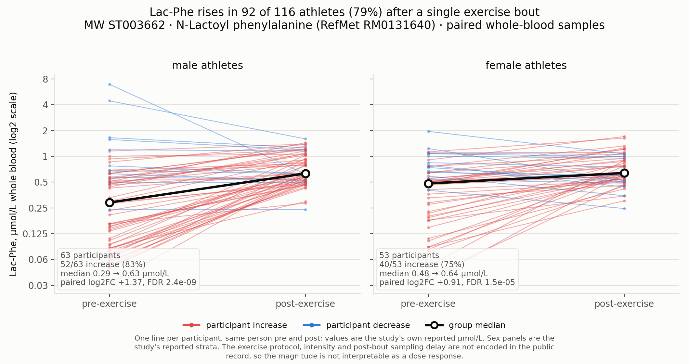

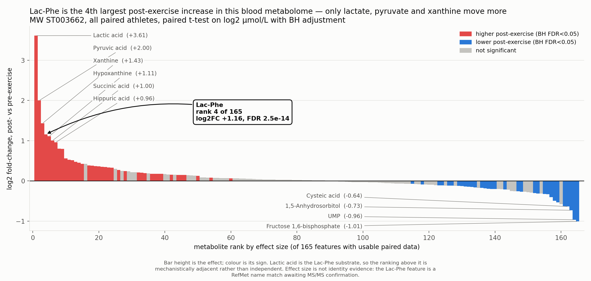

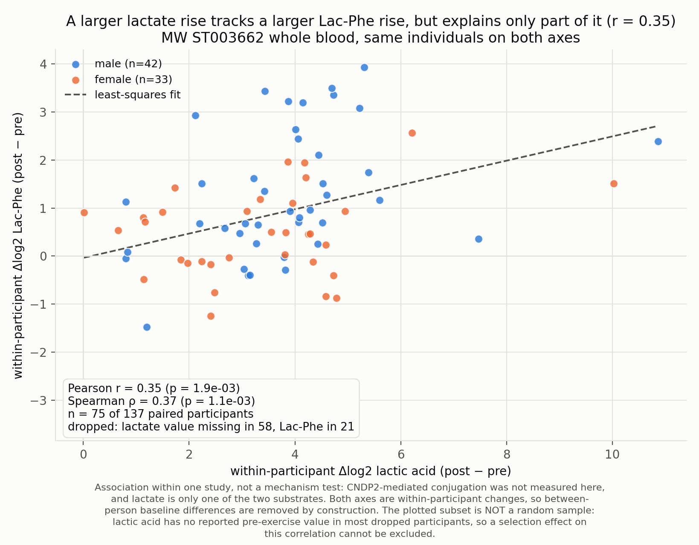

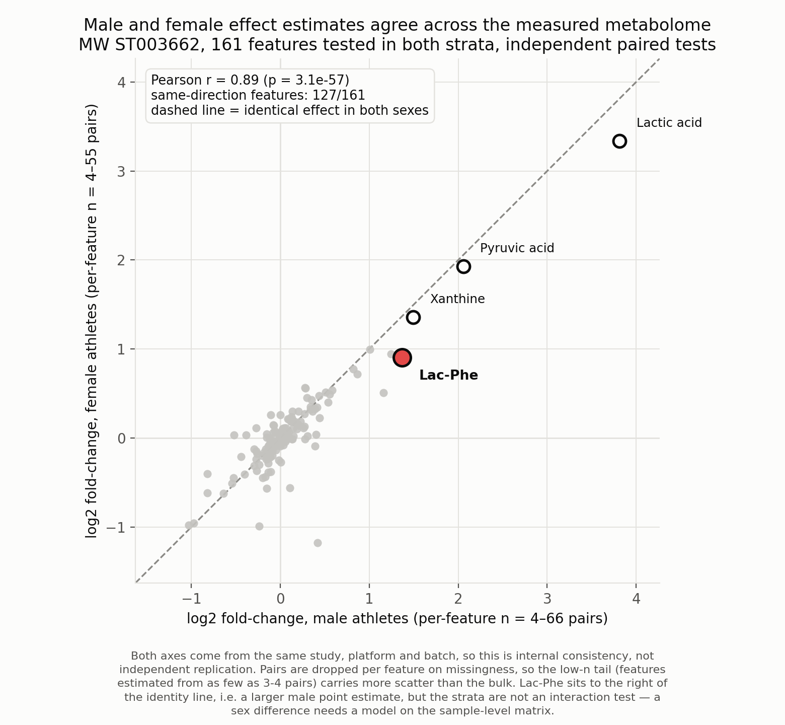

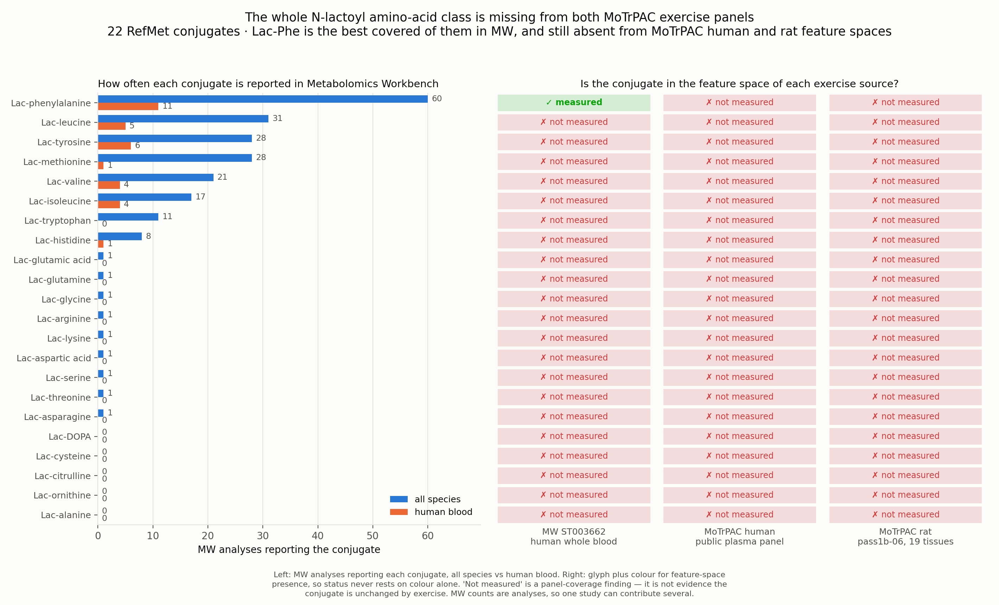

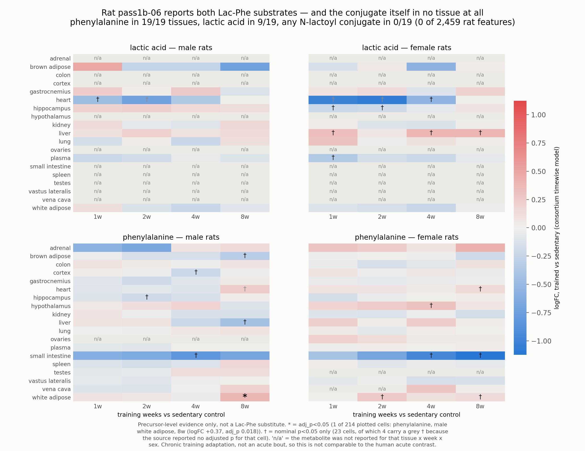

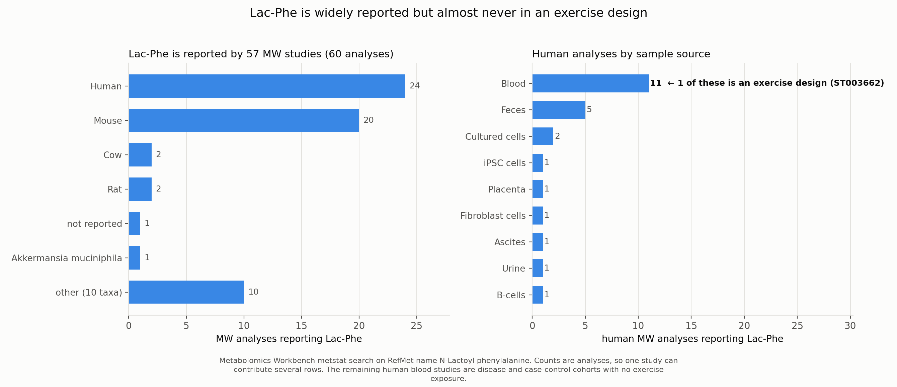

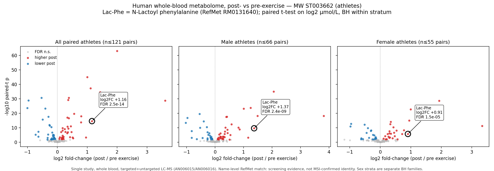

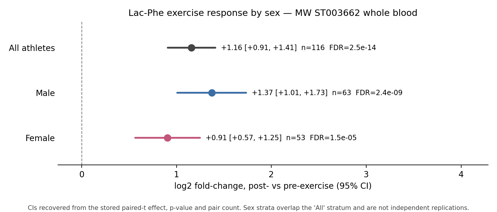

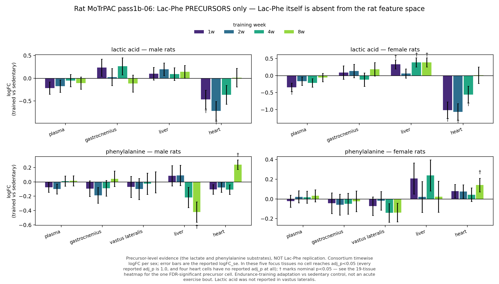

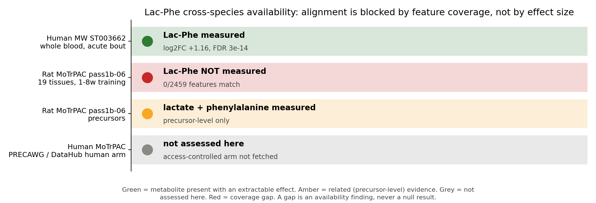

## Human MoTrPAC arm

The human MoTrPAC arm was **not** fetched for this report. The DataHub human arm is access-controlled, and
this workbench does not fabricate records for embargoed data. Whether MoTrPAC's human plasma targeted and
untargeted panels carry Lac-Phe is an open availability question and is recorded as a mirage risk, not as
a negative result. The public human-precovid-sed-adu acute plasma DA tables already cached under
`data/live/volcano_motrpac_human_plasma_endur_post.csv` also contain no lactoyl-conjugate feature.

## Human-review escalations

| # | item | why a human must decide |
| --- | --- | --- |
| 1 | Assay identity of `Lactoyl Phenylalanine` in ST003662 | RefMet name match only. Level-1 confirmation (RT + MS/MS against an authentic standard) is not documented in the public record. The reported μmol/L values imply calibration that must be verified before quantitative claims. |
| 2 | Sex-difference claim | Male vs female point estimates differ but strata are nested with overlapping CIs; needs an interaction model on sample-level data. |
| 3 | Exercise protocol | ST003662 `Collectionpoint:Before/After` does not encode modality, intensity, duration, or post-exercise sampling delay. Lac-Phe kinetics are minute-scale, so the effect size is not interpretable without the timing. |
| 4 | Rat panel gap | Confirm against MoTrPAC panel documentation whether Lac-Phe was targeted and lost at QC, or never targeted. The two have different implications for a future request. |
| 5 | Any pooling or meta-analysis | Blocked. No shared analyte, different estimands, different matrices. |
| 6 | Whole blood vs plasma | ST003662 is whole blood; MoTrPAC is plasma. Lac-Phe partitioning between erythrocytes and plasma is not established here. |
| 7 | Data deposition for the published human exercise studies | 0 of 19 subject-confirmed human exercise records name a repository accession in their retrieved text. Full-text data availability statements must be read before any deposition gap is recorded as confirmed. |
| 8 | Literature coverage of pubmed | The index was unreachable from this egress, so its coverage is unknown. A reviewer must decide whether the sweep may be relied on or must be repeated from a permitted network path. |
| 9 | Subject identity of the 220 name-absent records | The index matched them on full text or relevance ranking, but the queried name is not in the retrieved title or abstract. `Lac-Phe` also abbreviates lactide-phenylalanine copolymers, so entity confirmation is a human call. |

## Missing evidence

- Exercise modality, intensity, duration, and post-exercise sampling delay for ST003662.
- MS/MS-level identity confirmation and calibration provenance for the ST003662 Lac-Phe feature.
- Whether rat pass1b-06 panels ever targeted N-lactoyl conjugates.
- Lac-Phe availability in the access-controlled human MoTrPAC arm.
- Independent human exercise studies measuring Lac-Phe in MW (none found beyond ST003662).
- Deposited data for the 19 subject-confirmed human exercise
  records found in the literature: no accession appears in their retrieved bibliographic text and full
  texts were not read.
- Study-level identity across those records: companion papers and overlapping cohorts are unresolved,
  so the count of distinct human exercise cohorts is an upper bound.
- Full-text methods for MSI-level identity and calibration in the published human exercise studies.
- pubmed literature coverage for this query (index unreachable from this egress).

## Reproduction

Live steps 1-5 need network access; steps 6-9 are offline. Every step writes under `data/live/`,
`reports_live/` or both, and none touches the offline pilot.

```bash
# 1. resolve the RefMet identity and find every MW study reporting Lac-Phe (network)
PYTHONPATH=src python3 -m metabotyping_agentic.cli live-search-metabolite-studies \
  --query "N-Lactoyl phenylalanine" \
  --name-variants "Lac-Phe;N-lactoylphenylalanine" \
  --out data/live/metabolite_search_lacphe

# 2. same search for all 22 N-lactoyl conjugates in RefMet, for the class-coverage figure (network)
grep -i "^N-Lactoyl" data/live/refmet_annotations.csv | cut -d, -f1 | while read -r name; do
  slug=$(echo "$name" | tr 'A-Z ' 'a-z_' | tr -cd 'a-z0-9_')
  PYTHONPATH=src python3 -m metabotyping_agentic.cli live-search-metabolite-studies \
    --query "$name" --out "data/live/metabolite_search_lacphe_family/$slug"
done

# 3. human pre/post effects + participant-level values + rat pass1b-06 coverage scan (network)
PYTHONPATH=src python3 scripts/volcano_compare.py --metabolite-scan "N-Lactoyl phenylalanine" \
  --name-variants "Lac-Phe;N-lactoylphenylalanine;lactoylphenylalanine" \
  --mw-studies ST003662

# 4. the lactate substrate, for the substrate-coupling figure (network; rat scan skipped)
PYTHONPATH=src python3 scripts/volcano_compare.py --metabolite-scan "Lactic acid" \
  --mw-studies ST003662 --scan-skip-rat

# 5. the published literature for the same subject (network)
PYTHONPATH=src python3 -m metabotyping_agentic.cli live-search-literature \
  --query "N-Lactoyl phenylalanine" \
  --name-variants "Lac-Phe;N-lactoylphenylalanine;lactoylphenylalanine;N-lactoyl-phenylalanine" \
  --out data/live/literature/lacphe --reports-out reports_live/literature

# 6. figure suite + one backing CSV per figure (offline)
python3 scripts/render_lacphe_figures.py

# 7. this report (offline)
python3 scripts/render_lacphe_report.py

# 8. PDF render of this report with the figure plates embedded (offline)
python3 scripts/render_markdown_pdf.py \
  reports_live/lacphe/lacphe_report.md reports_live/lacphe/lacphe_report.pdf

# 9. self-contained HTML render of this report, figures inlined (offline)
python3 scripts/render_markdown_html.py \
  reports_live/lacphe/lacphe_report.md reports_live/lacphe/lacphe_report.html
```

`data/live/volcano_motrpac_human_plasma_endur_post.csv` is reused from the earlier MoTrPAC human
plasma acute fetch rather than re-downloaded; its endpoints and signed-URL requests are recorded in
`data/live/volcano_provenance.json`.

Live fetch provenance:

- `data/live/metabolite_scan/n_lactoyl_phenylalanine/provenance.json` — human ST003662 scan + rat pass1b-06 coverage scan
- `data/live/metabolite_scan/lactic_acid/provenance.json` — lactate scan (rat scan skipped, recorded)
- `data/live/metabolite_search_lacphe/metstat_metabolite_study_provenance.json` — RefMet + metstat search
- `data/live/metabolite_search_lacphe_family/<conjugate>/metstat_metabolite_study_provenance.json` — 22 conjugate searches
- `data/live/volcano_provenance.json` — MoTrPAC human plasma acute panel fetch
- `data/live/literature/lacphe/literature_provenance.json` — literature sweep: per-index status, query expression, endpoint URLs, hit and retrieved counts

| gate | status |
| --- | --- |
| FAIR provenance | pass — accession, analysis id, source URL, license, matrix, contrast, statistic recorded |
| reproducibility | pass — regenerated from declared queries and deterministic matching rules |
| critical evidence | pass — exact vs precursor vs missing evidence kept distinct |
| human review | pass — 9 report-level escalations plus 419 record-level literature escalations; harmonization blocked |
| mirage detection | pass — rat gap, embargoed human arm, and the unreachable literature index are reported as availability findings, never as negative results |
| literature evidence tiering | pass — peer-reviewed, preprint, secondary-synthesis and retracted records kept in separate tiers; name matches without subject confirmation escalated, not counted |
